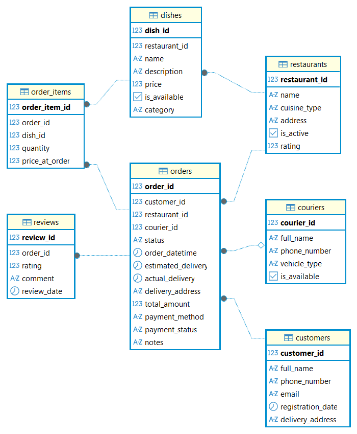

# Food Delivery Service Database Project

**Проект на PostgreSQL, имитирующий реальную базу данных для сервиса доставки еды. Разработан для демонстрации навыков проектирования БД, знания SQL и аналитического мышления.**

## Содержание

- Обзор проекта
- Архитектура базы данных
- Структура проекта
- Технологический стек и навыки
- Примеры кода
- Сгенерированные данные

## Обзор проекта

Данный проект представляет собой полноценную реляционную базу данных для платформы доставки еды, охватывающую полный цикл работы с данными:

1. **Проектирование:** Концептуальная, логическая и физическая модели.
2. **Реализация** DDL-скрипты с ограничениями, индексами и триггерами.
3. **Наполнение:** Генерация правдоподобных тестовых данных.
4. **Бизнес-логика:** Хранимые процедуры, функции и автоматизация.
5. **Аналитика:** Сложные SQL-запросы, оконные функции, CTE и витрины данных.

**Цель проекта:** На реальном бизнес-сценарии продемонстрировать навыки работы с SQL и базами данных, включая проектирование, оптимизацию и анализ.

## Архитектура баз данных

### Диаграмма сущность-связь (ER Diagram)



**Ключевые сущности:**

- **customers** - Клиенты сервиса, их профили и история заказов.
- **restaurants** - Рестораны-партнеры с типом кухни и рейтингом.
- **dishes** - Позиции меню с актуальными и историческими ценами.
- **orders** - Центральная транзакционная сущность с жизненным циклом заказа.
- **order_items** - Таблица-связка для разрешения связи "Многие ко многим" между заказами и блюдами. Фиксируем цену на момент заказа.
- **couriers** - Курьеры с информацией о транспорте и доступности.
- **reviews** - Отзывы клиентов на доставленные заказы.

## Структура проекта

README.md - Этот файл
docs/
|-- ER_Diagram.png - Визуальная схема базы данных
sql/
|-- 01_ddl.sql - Создание таблиц, ограничений
|-- 02_index - Создание индексов
|-- 03_triggers.sql - Триггеры и хранимые функции (бизнес-логика)
|-- 04_stored_procedures.sql - Процедуры для приложения
|-- 05_generate_data.sql - Генерация данных
|-- 06_analytical_views - Витрины данных
|-- 07_window_functions - Оконные функции
|-- 08_cte - CTE
|-- 09_business_metrics - Бизнес-метрики

## Технологический стек и навыки

- **PostgreSQL:** Основная СУБД. Использованы расширенные типы данных, триггеры, индексы.
- **DBaver:** Основной инструмент разработки - написание SQL, визуализация ER-диаграмм, отладка запросов, администрирование БД.
- **SQL(DDL):** Проектирование схемы - CREATE TABLE, ограничения (PRIMARY KEY, FOREIGN KEY, CHECK, UNIQUE).
- **SQL(DML):** Генерация и вставка тестовых данных, сложные SELECT запросы.
- **Оконные функции:** ROW_NUMBER(), RANK(), LAG()/LEAD(), AVG() OVER() для аналитики.
- **CTE(WITH):** Структурирование сложных запросов.
- **PL/pgSQL:** Написание триггеров и хранимых функций для автоматизации бизнес-логики.

## Примеры кода

**1. Проектирование: Критически важное поле _price_at_order_**
```
CREATE TABLE order_items (
order_item_id SERIAL PRIMARY KEY,
order_id INTEGER NOT NULL,
dish_id INTEGER NOT NULL,
quantity INTEGER NOT NULL CHECK (quantity > 0),
price_at_order DECIMAL(10,2) NOT NULL CHECK (price_at_order > 0),

    CONSTRAINT fk_order_items_orders
        FOREIGN KEY (order_id)
        REFERENCES orders(order_id)
        ON DELETE CASCADE,

    CONSTRAINT fk_order_items_dishes
        FOREIGN KEY (dish_id)
        REFERENCES dishes(dish_id),

    CONSTRAINT unique_order_dish
        UNIQUE (order_id, dish_id)

);

```
**2. Автоматизация: Триггер перерасчёта суммы заказа**
```
CREATE OR REPLACE FUNCTION update_order_total()
RETURNS TRIGGER AS $$
BEGIN
	UPDATE orders
	SET total_amount = (
		SELECT COALESCE(SUM(quantity \* price_at_order), 0)
		FROM order_items
		WHERE order_id = COALESCE(NEW.order_id, OLD.order_id)
	)
	WHERE order_id = COALESCE(NEW.order_id, OLD.order_id);
	
	    RETURN NEW;

END;
$$LANGUAGE plpgsql;
```
**3. Аналитика: Скользящие средние и кумулятивные суммы**
```
with daily_revenue as (
	select
		date(order_datetime) as order_date,
		sum(total_amount) as daily_revenue,
		count(distinct order_id) as daily_orders,
		avg(total_amount) as avg_order_value
	from orders
	where status = 'delivered'
	group by date(order_datetime)
)
select
	order_date,
	daily_revenue,
	daily_orders,
	avg_order_value,

	avg(daily_revenue) over (
		order by order_date
		rows between 6 preceding and current row
	) as revenue_7day_avg,

	sum(daily_revenue) over(
		order by order_date
		rows between unbounded preceding and current row
	) as cumulative_revenue,

	daily_revenue * 100.0 / sum(daily_revenue) over() as revenue_percentage,

    daily_revenue - lag(daily_revenue, 1) over(order by order_date) as revenue_change,

    round(
        (daily_revenue - lag(daily_revenue, 1) over(order by order_date)) * 100.0 /
        lag(daily_revenue, 1) over(order by order_date),
        2
    ) as revenue_change_percent

from daily_revenue
order by order_date;
```
**4. CTE и анализ сочетаемости блюд**
```
with dish_combinations as (
	select
		oi1.dish_id as dish_1,
		oi2.dish_id as dish_2,
		count(distinct oi1.order_id) as times_ordered_together,
		d1.name as dish_1_name,
		d2.name as dish_2_name,
		d1.category as dish_1_category,
		d2.category as dish_2_category
	from order_items oi1
	join order_items oi2 on oi1.order_id = oi2.order_id and oi1.dish_id < oi2.dish_id
	join dishes d1 on oi1.dish_id = d1.dish_id
    join dishes d2 on oi2.dish_id = d2.dish_id
    group by oi1.dish_id, oi2.dish_id, d1.name, d2.name, d1.category, d2.category, d1.restaurant_id, d2.restaurant_id
    having count(distinct oi1.order_id) >= 3
),
combination_rank as (
	select
		*,
		rank() over(partition by dish_1_category order by times_ordered_together desc) as rank_in_category
	from dish_combinations
)
select
	dish_1_name,
	dish_2_name,
	dish_1_category,
	dish_2_category,
	times_ordered_together,
	rank_in_category
from combination_rank
where rank_in_category <= 5
order by dish_1_category, rank_in_category
```
## Сгенерированные данные

    Таблица   Кол-во записей         Описание
- **customers** - 100 - Реалистичные клиентские профили с адресами
- **restaurants** - 15 - Рестораны разных кухонь с рейтингами.
- **dishes** - 150 - Детализированное меню с описаниями и ценами.
- **orders** - 500 - Полный жизненный цикл заказов за несколько месяцев.
- **order_items** - 1200 - Конкретные позиции в каждом заказе.
- **couriers** - 25 - Курьеры с типом транспорта и доступностью.
- **reviews** - 150 - Отзывы и рейтинги к доставленным заказам.

